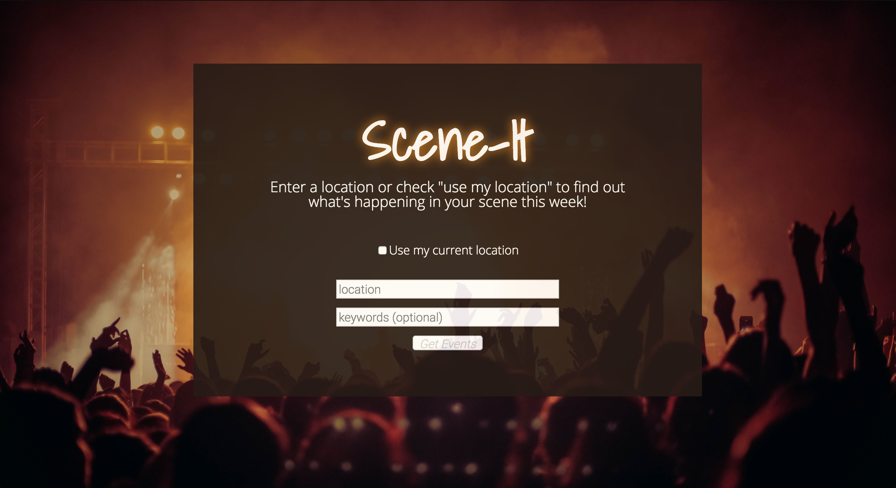
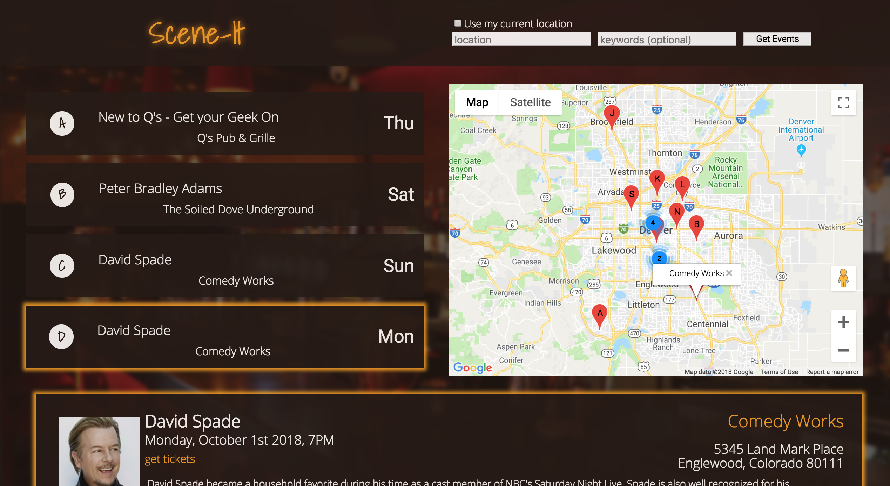

# Scene-It

This app allows users to search for events in a given area and see details about the events, as well as locations on a map. Powered by the eventful api and google maps / geolocation, this project was completed in two weeks for review as part of the front end curriculum at Turing School of Software and Design in Denver, Co. The concept, architecture, and design are my own.

## Getting Started

To get the app up and running, enter the following commands in the terminal:

```
git clone https://github.com/dsdunn/scene-it
cd scene-it
npm install
npm start
```

## Running the tests

The testing suite is built with Enzyme and Jest. To run:

```
npm test
```


## Built With

* [React](https://reactjs.org/) - (create-react-app)
* [React-Router](https://reacttraining.com/react-router/web/guides/philosophy) 
* [Redux](https://redux.js.org/)
* [google-map-react](https://www.npmjs.com/package/google-map-react) 


## Authors

* **David Starr Dunn** - *Initial work* - [@dsdunn](https://github.com/dsdunn)




